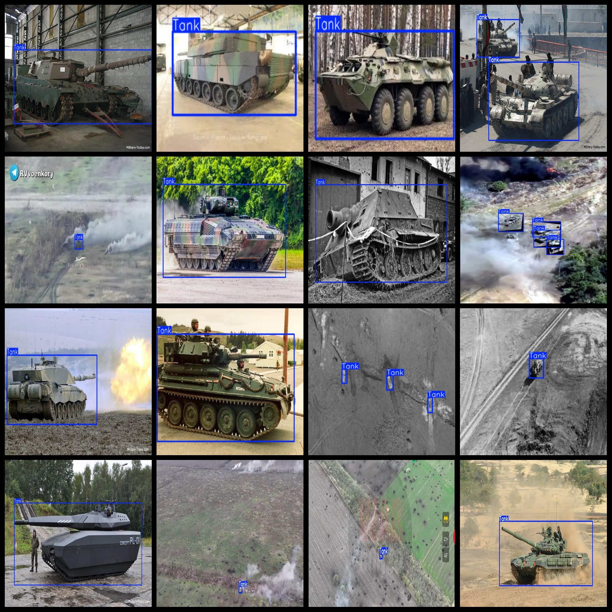
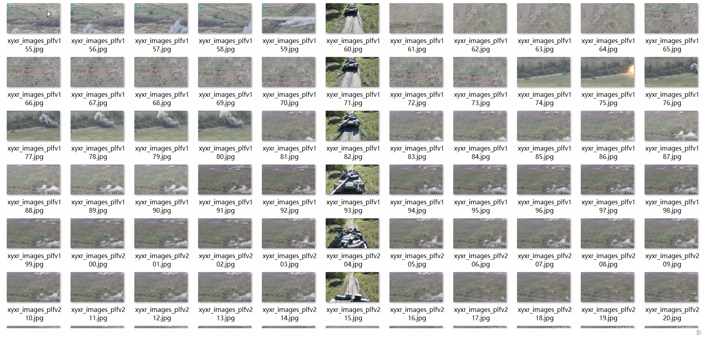

# Tank Dataset 3469 imagesVOC+YOLO format

The tank dataset contains 3469 images in VOC+YOLO format.

Dataset format: Pascal VOC format + YOLO format (the txt file does not contain the split path, it only contains jpg images and corresponding VOC format xml files and yolo format txt files)

Number of images (number of jpg files): 3469

Number of xml files: 3469

Number of files: 3469

Number of categories: 1

The Github repository is: datasets_sl

["Tank"]

Number of boxes labeled in each category:

Tank Frames = 5788

Total frame count: 5788

Number of images per category:

Tank has 3469 pictures

Resolution of the image: Multi-resolution images, such as 300x168, 416x416, etc.

Use the labeling tool: labelImg

Dataset Augmentation: Yes

Rules for annotation: Draw a rectangle around the category.

Important note: The dataset does not have been divided into training, validation, and testing sets.

Special Disclaimer: This dataset does not guarantee the accuracy of the trained models or weight files.

Annotation and image details are as follows:

## Images

---

Here is a pay link on Stripe (https://buy.stripe.com/3cs8yP7sY87d0vu9AB). Please contact me lonlonago@foxmail.com after funding $89, and I will send you a complete data files, thank you!

